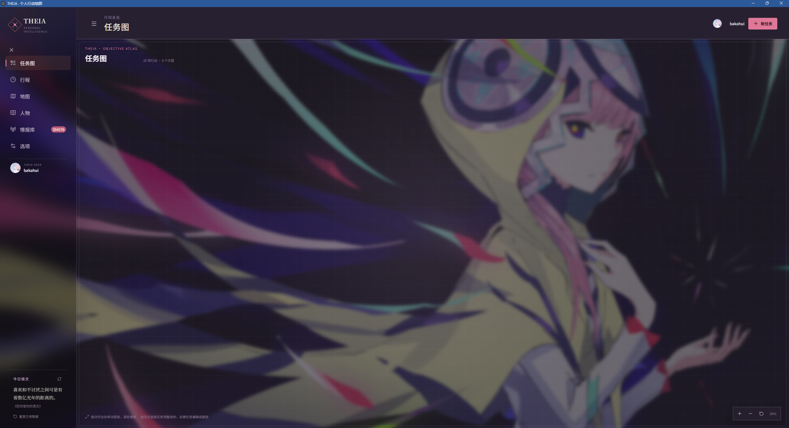
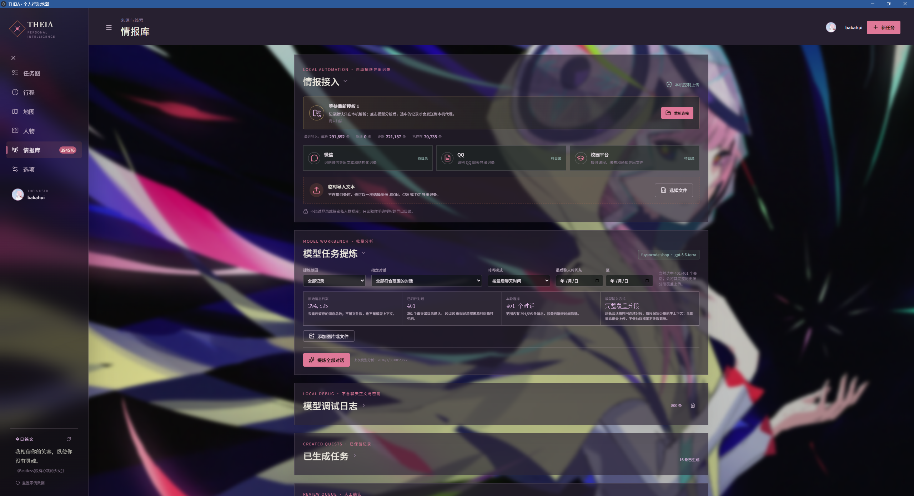
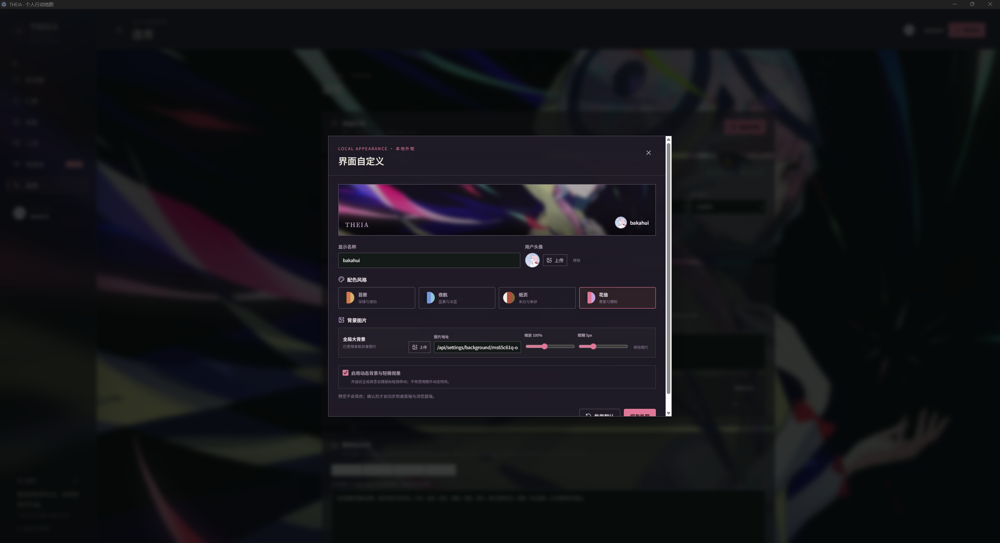

# THEIA

THEIA 是一个本地优先的个人现实任务图工具。它把你主动导出的微信、QQ、校园平台等聊天记录整理为可审核的候选任务，并把任务、行程、地点、人物和原始证据放在同一个界面中。

它不是聊天软件插件，也不会绕过登录或解密应用数据库。THEIA 只读取你明确选择的导出文件；只有在你启动模型提炼后，选中的记录才会发送到你配置的模型服务。

> 当前源码版本：`0.2.1`。现有 Windows x64 便携版仍为 `0.1.1`；便携版自带 Electron 与 Node.js 运行时，无需另行安装 Node.js，任务、设置、聊天归档和日志保存在 `%APPDATA%\\THEIA`。重要数据请定期备份。

## 0.1.0 至 0.2.1 更新简介

- 从源码预览发展为本地优先的桌面与浏览器双端工具：导入聊天记录后，可统一管理任务图、行程、人物、地点和可追溯的原始证据。
- 提炼改为按会话时间线处理，支持严格时间范围、过期事项过滤、候选审核、人物事实与任务建议，避免把聊天的发言方向混淆。
- 增加开源地图搜索、标记编辑、人物头像、可缩放任务图、外观与背景自定义，以及浏览器和桌面端数据同步。
- 引入多 API 通道池和会话级并发调度：不同会话可占满健康通道，同一会话仍按时间顺序分段，降低重复 token 消耗并隔离 502、限流和超时故障。
- 新增通道利用率、按任务时间戳日志、批量清理和暂停/恢复提炼；关闭后可从已完成对话继续，不再保存重复的“已生成候选”临时归档。

完整变化、升级注意事项和验证结果见 [更新报告](docs/RELEASE_NOTES.md)。

## 界面预览

<p align="center">
  
</p>
<p align="center"><sub>可缩放、可平移并支持拖拽归类的任务图</sub></p>

<table>
  <tr>
    <td width="50%" align="center"><br><sub>情报接入与模型提炼工作台</sub></td>
    <td width="50%" align="center"><br><sub>主题、头像与全局背景自定义</sub></td>
  </tr>
</table>

## 能做什么

- 递归扫描导出目录，识别 JSON、CSV、TXT，并按会话归档和去重。
- 保留原始消息正文、时间、发言人、发言方向、消息类型、平台、会话和头像 URL。
- 按“最后聊天时间”筛选整段会话，或用“严格时间”只提交指定时间段内的消息。
- 对超长会话做连续分段，覆盖全部记录，并在相邻段之间保留少量上下文重叠；不会用固定消息条数随机抽样。
- 支持配置多条独立模型 API 通道，按每条容量对不同会话负载均衡；某条通道限流、网关失败或超时时，其他通道可继续工作。
- 私聊任务与人物证据共用一次模型输入，减少重复上传和 token 消耗；群聊保持任务-only。
- 将模型结果先放入候选审核队列，支持编辑、选择、批量生成、忽略和磨合反馈。
- 同步生成有证据引用的人物卡，缓存导出记录中可访问的头像，并按关系信号排序。
- 用可缩放、可平移、可拖拽归类的任务图展示任务；任务完成状态与行程保持一致。
- 使用开源地图底图和公共地理搜索，支持搜索、选点、拖动、编辑、删除和近似范围。
- 根据关联人物、任务时间、地点及未来 16 天内可用天气生成行动建议。
- 将大聊天归档、轻量界面状态、INI 设置、图片和日志分开保存，降低大数据量下的同步开销。
- 桌面版默认启用 Chromium GPU 合成；也提供软件渲染故障回退。

## 环境要求

| 项目 | 要求 |
| --- | --- |
| 操作系统 | 发布启动器面向 Windows 10/11 x64；源码可自行适配其他桌面系统 |
| Node.js | 最低 `22.12.0`，推荐 Node.js 24 LTS x64；当前验证版本为 `24.13.0` |
| npm | 随受支持的 Node.js 安装，当前验证版本为 `11.18.0` |
| 磁盘 | 建议至少预留 1 GB 安装依赖；聊天、图片和日志另计 |
| 内存 | 建议 8 GB 以上；数十万条聊天记录建议 16 GB 以上 |
| 浏览器 | 浏览器模式推荐最新版 Chrome 或 Edge；目录连接依赖 File System Access API |
| 网络 | 首次安装依赖需要；地图、地点搜索、在线语录、远程头像、天气和模型服务需要 |
| 模型服务 | 可选；使用模型提炼时需要 OpenAI 风格的兼容 API 和有效 API Key |

不要只看“Node 20 LTS 或更高”。当前依赖中的 Electron 43 和 OpenAI JavaScript SDK 7 要求 Node.js 22，因此 `22.12.0` 才是本项目的实际最低版本。

## 快速开始

### 从源码工作区启动

在项目根目录打开 PowerShell：

```powershell
npm install
npm run desktop
```

也可以双击 `启动桌面版.cmd`。脚本会结束由当前项目启动的旧 THEIA 实例和占用本地 API 端口的旧进程，再启动新的桌面窗口。

浏览器开发模式：

```powershell
npm run dev
```

然后打开终端显示的本地地址，通常为 `http://127.0.0.1:5173/`。不要直接双击 `index.html`，因为设置、模型、地图代理和共享存储需要本地 Node.js 服务。

### 从源码发布包启动

发布包不是免安装 EXE。第一次使用，在发布包的 `app` 目录打开 PowerShell：

```powershell
npm install
```

安装完成后回到发布包根目录，双击：

- `启动 THEIA 桌面版.cmd`：推荐，独立窗口，支持 GPU 加速。
- `启动 THEIA 浏览器版.cmd`：启动本地服务后，在 Chrome/Edge 中使用。

发布包用户应优先阅读 [用户手册](docs/USER_GUIDE.md)。

## 第一次使用

1. 打开“选项”，先设置显示名称、头像、主题和全局背景。
2. 在“模型通道池”填入 API 根地址、明文 API Key，并点击检测模型列表；单条 API 受限时可再添加独立通道。
3. 选择用于结构化输出的对话模型，保留 API 模式为“自动”即可。
4. 在“情报库”导入少量示例或自己的一个私聊会话。
5. 打开会话，检查时间、发言人以及“你/对方”方向是否正确。
6. 用严格时间范围做第一次模型提炼，先看候选和人物卡，再扩大范围。
7. 候选确认后生成任务；不合适的候选要选择原因后忽略，磨合记录会影响后续提示。

模型通道与导入格式的完整说明见 [用户手册](docs/USER_GUIDE.md) 和 [聊天导出格式](docs/CHAT_EXPORT_FORMAT.md)。

## 数据如何流动

```text
用户主动导出的 JSON / CSV / TXT
                |
                v
      浏览器内本地解析与去重
                |
                +----> 原始归档（独立大文件 / IndexedDB）
                |
                v
      用户选择会话、范围并启动提炼
                |
                v
       127.0.0.1:8787 本地代理
                |
                v
          用户配置的模型服务
                |
                v
       候选任务 + 人物证据 + 建议
                |
                v
       用户审核后写入任务和人物状态
```

前端不会直接持有模型密钥。密钥由本地 Node.js 服务读取并写入通用 INI。当前产品按用户要求以明文保存 Key，方便编辑和迁移，因此 `settings.ini` 必须作为密码文件保护。

## 开发与发布目录

开发工作区为了兼容历史版本，仍使用根目录下的 `.theia-*` 文件。发布包启用清晰的运行时布局：

```text
THEIA-release/
  app/                       应用源码、依赖清单和运行脚本
  assets/img/
    backgrounds/             用户上传的全局背景
    avatars/                 从导出记录下载的联系人头像缓存
  data/
    state.json               任务、人物、地点、候选和任务图布局
    chat-archive.json.gz      原始聊天归档（gzip 压缩），旧 JSON 可自动迁移
    settings.ini             名称、外观、提示词、模型地址和明文 Key
    electron/                桌面版 Chromium 数据
    runtime/desktop.pid      运行中的桌面实例标记
    examples/                完全虚构的导入示例
  logs/
    ai-debug.jsonl           不含正文的管线摘要日志
    tasks/*.jsonl.gz         按工作单元记录的压缩模型输入/输出日志
  docs/                      用户、开发者、格式、隐私和排错文档
```

工作单元日志可能包含完整聊天正文；`data/`、`logs/`、`assets/img/avatars/` 都不应公开上传。

### 存储压缩与迁移

原始聊天归档现在以 `chat-archive.json.gz`（开发目录为 `.theia-shared-intel.json.gz`）保存，读取时仍兼容旧的未压缩 JSON。首次启动会在压缩文件成功写入后自动迁移并删除旧 JSON，不会覆盖原文件失败的迁移。

已完成的任务日志会压缩为 `*.jsonl.gz`；服务启动时会继续整理超过 10 分钟的旧日志。调试摘要日志限制为约 8 MB，并保留最多 3 个轮转文件，避免长期运行无限增长。

## 常用命令

| 命令 | 作用 |
| --- | --- |
| `npm run dev` | 同时启动本地 API 与 Vite 浏览器开发服务器 |
| `npm run dev:web` | 只启动 Vite；需要另行启动 API |
| `npm run dev:api` | 只启动 `127.0.0.1:8787` 本地 API |
| `npm run desktop` | 启动 Electron、本地 API 和 Vite |
| `npm test` | 用两个本地假服务验证多 API 分流、故障隔离和日志脱敏，不调用真实模型 |
| `npm run build` | TypeScript 项目构建检查并生成 `dist/` |
| `npm run lint` | 执行 ESLint |
| `npm run preview` | 预览 Vite 构建产物；涉及 API 的功能仍需本地服务 |
| `npm run dev:release` | 在发布布局中启动浏览器版 |
| `npm run desktop:release` | 在发布布局中启动桌面版 |
| `npm run release:index` | 扫描工作根目录中的版本产物，更新发布索引与 SHA-256 清单 |

发布工具：

```powershell
node release-tools/package-release.mjs ..\staging\v0.1.2\THEIA-release-0.1.2
npm run dist:exe -- ..\staging\v0.1.2\THEIA-0.1.2-portable
npm run release:index
```

打包器拒绝覆盖已有目录，也不会复制聊天、设置、密钥、日志、头像缓存、背景历史、浏览器资料、`node_modules`、`dist` 或 Git 元数据。

## 文档索引

- [更新报告](docs/RELEASE_NOTES.md)：当前版本重点、兼容性、已知限制与验证结果。
- [用户手册](docs/USER_GUIDE.md)：面向第一次接触命令行和本地模型工具的用户。
- [开发者文档](docs/DEVELOPER_GUIDE.md)：技术栈、模块边界、状态流、模型流水线、API、性能和发布。
- [聊天导出格式](docs/CHAT_EXPORT_FORMAT.md)：推荐 JSON/CSV/TXT 字段、目录结构、发言方向和头像规则。
- [故障排查](docs/TROUBLESHOOTING.md)：启动、端口、GPU、导入、0 候选、502/403、地图和数据恢复。
- [隐私与数据](docs/PRIVACY_AND_DATA.md)：文件敏感等级、模型传输、备份、迁移和问题报告脱敏。
- [版本管理](docs/VERSIONING.md)：工作目录布局、语义化版本、发布步骤、校验、标签和回滚规范。

## 重要边界

- 任务和人物结论来自概率模型，必须由用户审核；THEIA 不能保证没有遗漏或误判。
- 发言方向无法从导出字段可靠确定时，应用会标记为未知；不要靠昵称猜测“你”和“对方”。
- 地图、天气、在线语录和头像地址依赖第三方公共服务，可能受限流、网络或地区影响。
- 自动提炼的最短间隔是 24 小时，且当前需要应用页面保持打开；它不是系统后台服务。
- 当前没有加密数据库。保护 Windows 账户、磁盘和备份介质是用户责任。
- 当前没有自动升级旧数据 schema 的正式兼容承诺。升级前先备份整个运行时目录。

本项目只支持用户授权的导出数据，不提供绕过登录、盗取凭据、解密私人数据库或未授权抓取能力。
