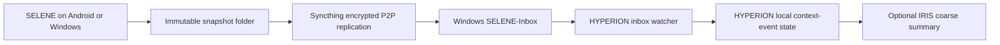

# SELENE Remote P2P Sync

[English](SELENE_P2P_SYNC.md) | [简体中文](SELENE_P2P_SYNC.zh-CN.md)

SELENE collects locally first. Remote delivery is handled by Syncthing and
HYPERION, not by QQ. This keeps QQ credentials, platform message rules, raw
snapshot files, precise coordinates, and transport retries outside SELENE.

## Architecture



There is no self-hosted relay or cloud storage in this design. When peers are
not on the same network, Syncthing may use public discovery, NAT traversal, or
an encrypted relay. A relay can see connection metadata and encrypted traffic,
but not snapshot plaintext. Completely remote operation with no external
coordination or relay infrastructure is not technically possible through NAT.

## Ownership Boundaries

| Component | Owns | Must not do |
| --- | --- | --- |
| SELENE | Collect local signals and snapshots; embed Android Syncthing identity/Send Only folder; create one-use enrollment on Windows. | Store QQ/HYPERION credentials, put a GUI API key in the QR, persist one-use tokens, upload to QQ, or rewrite snapshots. |
| Syncthing | Transport the user-selected folder between approved devices. | Interpret SELENE events or expose data to HYPERION's model. |
| HYPERION | Validate, normalize, deduplicate, and locally store context events. | Modify or delete files in the receive-only inbox; expose raw events through the Bot API. |
| IRIS | Owner-only QQ commands and narrow summaries. | Carry snapshot files, coordinates, raw values, or a general HYPERION sync snapshot. |

## 1. Prepare Windows

Run the repository script from the shared workspace root in PowerShell once:

```powershell
Set-Location .\HYPERION\source
.\scripts\setup-selene-p2p.ps1 -InstallSyncthing -ConfigureSyncthingFolder -RegisterStartAtLogon
```

It creates `<workspace-root>\SELENE-Inbox` next to the repositories, stores the current-user
`HYPERION_SELENE_INBOX` environment variable, and can install the official
Syncthing package through winget. With `-RegisterStartAtLogon`, it also creates
a current-user Startup shortcut that starts Syncthing hidden with `--no-browser`.
`-ConfigureSyncthingFolder` creates or validates folder ID `selene-inbox-v1`
as **Receive Only**. It does not configure a remote device or modify Syncthing
trust settings.

Restart HYPERION after setting the environment variable. For development,
`scripts/dev.mjs` reads a local `.env`; alternatively set the variable before
launching the server:

```powershell
$env:HYPERION_SELENE_INBOX = (Resolve-Path '..\..\SELENE-Inbox').Path
npm run dev:api
```

`HYPERION_SELENE_SYNC_INTERVAL_MS` is optional. It defaults to 30 seconds and is
bounded between 5 seconds and 15 minutes. `HYPERION_SELENE_SYNC_SETTLE_MS`
defaults to 4 seconds and is bounded between 1 and 60 seconds.

## 2. Pair Once by QR

SELENE 0.5.0 no longer requires a separate Android Syncthing client or manual
device-ID entry on both peers:

1. In SELENE Windows, confirm the inbox and generate an Android one-time QR.
2. Temporarily place both peers on one trusted LAN and scan or paste the code
   in Android SELENE.
3. Windows enrollment approves the phone and shares `selene-inbox-v1`;
   Android's embedded core creates its private Send Only folder automatically.
4. After success, leave the shared network. Global discovery, NAT traversal,
   and encrypted relay fallback provide later remote sync.
5. Restart HYPERION once so it inherits user-level `HYPERION_SELENE_INBOX`.

The QR expires after five minutes and carries a one-use token plus temporary
certificate pin, never the Syncthing GUI API key. Do not sync HYPERION's app
directory, `.env`, or credentials. See the complete
[SELENE pairing guide](https://github.com/bakahuiii/SELENE/blob/main/docs/P2P_SYNC.md).

## 3. How HYPERION Imports the Inbox

When `HYPERION_SELENE_INBOX` is configured, the local HYPERION server starts an
inbox watcher. It only considers this layout one level below the configured
directory:

```text
SELENE-Inbox/
  SELENE-v1-20260807T010000000Z/
    context-events.json
```

For each candidate it:

1. rejects symbolic links and files larger than 4 MiB;
2. waits for size and modification time to remain stable for the settle period;
3. validates the strict `selene-context-events/v1` producer envelope;
4. normalizes timestamps, scalar values, exact-location consent, and event IDs;
5. writes events through HYPERION's existing shared-state lock;
6. persists only file path, SHA-256, byte count, modification time, import
   time, and event count in its private inbox-state file.

An incomplete or invalid JSON file is retried after a later sync. A valid but
non-SELENE JSON file is recorded as ignored and never enters HYPERION state.
HYPERION never changes an inbox snapshot.

Imported events use a provenance path such as
`android/SELENE-v1-.../context-events.json`, allowing the existing narrow Bot
summary to count Android and Windows data without revealing the real path.

## 4. Status and Recovery

The status endpoint is local-only because the HYPERION server listens on
`127.0.0.1`:

```powershell
Invoke-RestMethod http://127.0.0.1:8787/api/selene-sync/status
```

It returns operational state, scan timestamps, counts, and a sanitized error.
It does not return events or coordinates.

| Situation | Expected behavior |
| --- | --- |
| Phone offline or Windows asleep | Syncthing catches up later; SELENE already has the local immutable snapshot. |
| A file appears half-synced | HYPERION leaves it untouched and retries after it is stable and valid JSON. |
| HYPERION restarts | Its private state file avoids reprocessing unchanged snapshot bytes. |
| Inbox state file is lost | HYPERION scans again; stable event IDs make the state merge idempotent. |
| A snapshot is re-synced | Its SHA-256 matches the recorded file and no import occurs. |
| Storage fills | Syncthing and HYPERION report a local error; neither deletes an old SELENE snapshot to recover space. |

## Security Checklist

- Pair only the intended phone and Windows device IDs.
- Use an Android export folder dedicated to SELENE; do not mix chat exports or
  credentials into it.
- Keep HYPERION on loopback. Do not forward port `8787` to a LAN, Tailscale, or
  public interface merely to sync SELENE.
- Treat Syncthing device IDs and connection metadata as private operational
  data even though snapshot contents are encrypted in transit.
- Use disk encryption on both endpoints if at-rest access is a concern.
- Query summaries through IRIS only when needed. Do not build a QQ command
  that returns coordinates, paths, or unfiltered `values`.

## Development Verification

```powershell
node --test tests\selene-inbox.test.mjs
node --test tests\selene-inbox-server.test.mjs
npm run test:context-events
```

The first test covers snapshot normalization, partial-file retry, and durable
file fingerprints. The second starts HYPERION with an inbox fixture and verifies
that a confirmed `movement` event reaches shared state through the normal lock.
