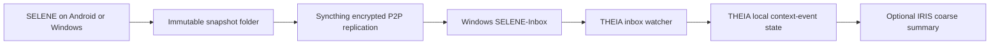

# SELENE Remote P2P Sync

[English](SELENE_P2P_SYNC.md) | [简体中文](SELENE_P2P_SYNC.zh-CN.md)

SELENE collects locally first. Remote delivery is handled by Syncthing and
THEIA, not by QQ. This keeps QQ credentials, platform message rules, raw
snapshot files, precise coordinates, and transport retries outside SELENE.

## Architecture



There is no self-hosted relay or cloud storage in this design. When peers are
not on the same network, Syncthing may use public discovery, NAT traversal, or
an encrypted relay. A relay can see connection metadata and encrypted traffic,
but not snapshot plaintext. Completely remote operation with no external
coordination or relay infrastructure is not technically possible through NAT.

## Ownership Boundaries

| Component | Owns | Must not do |
| --- | --- | --- |
| SELENE | Collect local non-text signals and create immutable snapshots. | Store Syncthing, QQ, or THEIA credentials; upload directly to QQ; rewrite prior snapshots. |
| Syncthing | Transport the user-selected folder between approved devices. | Interpret SELENE events or expose data to THEIA's model. |
| THEIA | Validate, normalize, deduplicate, and locally store context events. | Modify or delete files in the receive-only inbox; expose raw events through the Bot API. |
| IRIS | Owner-only QQ commands and narrow summaries. | Carry snapshot files, coordinates, raw values, or a general THEIA sync snapshot. |

## 1. Prepare Windows

Run the repository script from PowerShell once:

```powershell
cd H:\work\THEIA\source
.\scripts\setup-selene-p2p.ps1 -InstallSyncthing -ConfigureSyncthingFolder -RegisterStartAtLogon
```

It creates `H:\work\SELENE-Inbox`, stores the current-user
`THEIA_SELENE_INBOX` environment variable, and can install the official
Syncthing package through winget. With `-RegisterStartAtLogon`, it also creates
a current-user Startup shortcut that starts Syncthing hidden with `--no-browser`.
`-ConfigureSyncthingFolder` creates or validates folder ID `selene-inbox-v1`
as **Receive Only**. It does not configure a remote device or modify Syncthing
trust settings.

Restart THEIA after setting the environment variable. For development,
`scripts/dev.mjs` reads a local `.env`; alternatively set the variable before
launching the server:

```powershell
$env:THEIA_SELENE_INBOX = 'H:\work\SELENE-Inbox'
npm run dev:api
```

`THEIA_SELENE_SYNC_INTERVAL_MS` is optional. It defaults to 30 seconds and is
bounded between 5 seconds and 15 minutes. `THEIA_SELENE_SYNC_SETTLE_MS`
defaults to 4 seconds and is bounded between 1 and 60 seconds.

## 2. Pair the Devices in Syncthing

These actions need to happen on the actual phone, so they are deliberately not
automated by this repository:

1. Start Syncthing on Windows and record its device ID from its local UI.
2. Install a maintained Syncthing Android client and grant it access to a
   normal shared-storage folder, for example `Documents/SELENE-P2P`.
3. In SELENE, choose that same Android folder through the system folder picker
   as the export parent.
4. Pair the phone and Windows device IDs in Syncthing. Verify fingerprints on
   both devices rather than accepting an unsolicited pairing request.
5. Share the Android folder as **Send Only**. Share the Windows target
   `H:\work\SELENE-Inbox` as **Receive Only**.
6. Keep global discovery, NAT traversal, and encrypted relay fallback enabled
   when remote networks are required. Restrict background/mobile-data behavior
   in the Android sync client according to the user's battery and data plan.

Do not make the THEIA application directory, `.env`, or any credential store a
Syncthing folder. Sync only the SELENE snapshot export parent.

## 3. How THEIA Imports the Inbox

When `THEIA_SELENE_INBOX` is configured, the local THEIA server starts an
inbox watcher. It only considers this layout one level below the configured
directory:

```text
SELENE-Inbox/
  SELENE-v1-20260807T010000000Z/
    context-events.json
```

For each candidate it:

1. rejects symbolic links and files larger than 4 MiB;
2. waits for size and modification time to remain stable for the settle period;
3. validates the strict `selene-context-events/v1` producer envelope;
4. normalizes timestamps, scalar values, exact-location consent, and event IDs;
5. writes events through THEIA's existing shared-state lock;
6. persists only file path, SHA-256, byte count, modification time, import
   time, and event count in its private inbox-state file.

An incomplete or invalid JSON file is retried after a later sync. A valid but
non-SELENE JSON file is recorded as ignored and never enters THEIA state.
THEIA never changes an inbox snapshot.

Imported events use a provenance path such as
`android/SELENE-v1-.../context-events.json`, allowing the existing narrow Bot
summary to count Android and Windows data without revealing the real path.

## 4. Status and Recovery

The status endpoint is local-only because the THEIA server listens on
`127.0.0.1`:

```powershell
Invoke-RestMethod http://127.0.0.1:8787/api/selene-sync/status
```

It returns operational state, scan timestamps, counts, and a sanitized error.
It does not return events or coordinates.

| Situation | Expected behavior |
| --- | --- |
| Phone offline or Windows asleep | Syncthing catches up later; SELENE already has the local immutable snapshot. |
| A file appears half-synced | THEIA leaves it untouched and retries after it is stable and valid JSON. |
| THEIA restarts | Its private state file avoids reprocessing unchanged snapshot bytes. |
| Inbox state file is lost | THEIA scans again; stable event IDs make the state merge idempotent. |
| A snapshot is re-synced | Its SHA-256 matches the recorded file and no import occurs. |
| Storage fills | Syncthing and THEIA report a local error; neither deletes an old SELENE snapshot to recover space. |

## Security Checklist

- Pair only the intended phone and Windows device IDs.
- Use an Android export folder dedicated to SELENE; do not mix chat exports or
  credentials into it.
- Keep THEIA on loopback. Do not forward port `8787` to a LAN, Tailscale, or
  public interface merely to sync SELENE.
- Treat Syncthing device IDs and connection metadata as private operational
  data even though snapshot contents are encrypted in transit.
- Use disk encryption on both endpoints if at-rest access is a concern.
- Query summaries through IRIS only when needed. Do not build a QQ command
  that returns coordinates, paths, or unfiltered `values`.

## Development Verification

```powershell
node --test tests\selene-inbox.test.mjs
node --test tests\selene-inbox-server.test.mjs
npm run test:context-events
```

The first test covers snapshot normalization, partial-file retry, and durable
file fingerprints. The second starts THEIA with an inbox fixture and verifies
that a confirmed `movement` event reaches shared state through the normal lock.
