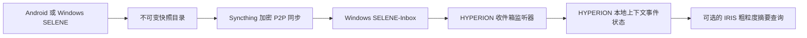

# SELENE 远程 P2P 同步

[English](SELENE_P2P_SYNC.md) | [简体中文](SELENE_P2P_SYNC.zh-CN.md)

SELENE 始终先在本地采集。远程传输由 Syncthing 和 HYPERION 负责，不经过 QQ。
因此 QQ 凭据、平台消息规则、原始快照、精确坐标和传输重试都不会进入 SELENE。

## 架构



这个设计不需要你自建中继或云存储。设备不在同一网络时，Syncthing 可能使用公共发现、NAT
穿透或加密中继；中继只能看到连接元数据和密文，不能读取快照明文。跨 NAT 的远程同步不依赖
任何外部协调或中继基础设施在技术上不可行。

## 职责边界

| 组件 | 负责什么 | 绝不能做什么 |
| --- | --- | --- |
| SELENE | 采集本地非文本信号，创建不可变快照；Android 内置 Syncthing 身份和 Send Only 文件夹；Windows 生成一次性 enrollment。 | 保存 QQ/HYPERION 凭据、在二维码中放 GUI API key、持久化一次性令牌、直接上传 QQ、改写旧快照。 |
| Syncthing | 在已信任设备间传输用户选定目录。 | 解释 SELENE 事件，或向 HYPERION 模型暴露数据。 |
| HYPERION | 验证、规范化、去重并本地保存上下文事件。 | 修改/删除 Receive Only 收件箱文件，通过 Bot API 暴露原始事件。 |
| IRIS | owner 专属 QQ 命令和窄摘要。 | 传输快照、坐标、原始 values 或通用 HYPERION 状态快照。 |

## 1. 准备 Windows

首次在 PowerShell 从共享工作区根目录执行仓库脚本：

```powershell
Set-Location .\HYPERION\source
.\scripts\setup-selene-p2p.ps1 -InstallSyncthing -ConfigureSyncthingFolder -RegisterStartAtLogon
```

脚本会在各项目旁创建 `<workspace-root>\SELENE-Inbox`，设置当前 Windows 用户的
`HYPERION_SELENE_INBOX` 环境变量，并可通过 winget 安装官方 Syncthing 包。传入
`-RegisterStartAtLogon` 时，它还会在当前用户的“启动”目录创建快捷方式，以 `--no-browser`
隐藏启动 Syncthing。`-ConfigureSyncthingFolder` 会创建或校验目录 ID
`selene-inbox-v1`，并强制它保持 **Receive Only**。脚本不会配置远程设备，也不会修改
Syncthing 的设备信任关系。

设置环境变量后需要重启 HYPERION。开发环境的 `scripts/dev.mjs` 会读取本地 `.env`；也可以在
启动服务前设置：

```powershell
$env:HYPERION_SELENE_INBOX = (Resolve-Path '..\..\SELENE-Inbox').Path
npm run dev:api
```

`HYPERION_SELENE_SYNC_INTERVAL_MS` 是可选项，默认 30 秒，限制在 5 秒到 15 分钟。
`HYPERION_SELENE_SYNC_SETTLE_MS` 默认 4 秒，限制在 1 到 60 秒。

## 2. 一次扫码配对

SELENE 0.5.0 不再要求另装 Android Syncthing 客户端，也不要求在两端手工录入设备 ID：

1. 在 SELENE Windows 的“Android 一次配对同步”中确认收件箱并生成二维码。
2. 手机与 Windows 暂时连接同一可信局域网，在 Android SELENE 扫描二维码或粘贴代码。
3. Windows enrollment 自动批准手机并共享 `selene-inbox-v1`；Android 内置核心自动建立
   Send Only 私有目录。
4. 配对成功后可离开同一网络。全局发现、NAT 穿透和加密中继回退负责后续远程同步。
5. 首次完成后重启 HYPERION，使它继承用户级 `HYPERION_SELENE_INBOX`。

二维码只有 5 分钟有效，包含一次性令牌和临时证书指纹，不包含 Syncthing GUI API key。
不要把 HYPERION 应用目录、`.env` 或凭据目录放进 Syncthing。完整协议、安全边界和排错见
[SELENE 一次配对文档](https://github.com/bakahuiii/SELENE/blob/main/docs/P2P_SYNC.zh-CN.md)。

## 3. HYPERION 如何导入收件箱

配置 `HYPERION_SELENE_INBOX` 后，本机 HYPERION 服务会启动收件箱监听器。它只处理配置目录下一层
符合以下布局的内容：

```text
SELENE-Inbox/
  SELENE-v1-20260807T010000000Z/
    context-events.json
```

每个候选文件都会：

1. 拒绝符号链接和大于 4 MiB 的文件；
2. 等待大小和修改时间在 settle 时间内稳定；
3. 验证严格的 `selene-context-events/v1` producer 信封；
4. 规范化时间、标量 values、精确位置同意记录和事件 ID；
5. 使用 HYPERION 现有共享状态锁写入事件；
6. 在私有收件箱状态文件中仅记录路径、SHA-256、字节数、修改时间、导入时间和事件数。

不完整或无效 JSON 会等待下一次同步后重试。完整但非 SELENE 的 JSON 会被记录为忽略，绝不会
进入 HYPERION 状态。HYPERION 不会修改任何收件箱快照。

导入事件的来源会形如 `android/SELENE-v1-.../context-events.json`，现有的 QQ 摘要因而可以
统计 Android/Windows 数据，但不会泄露真实路径。

## 4. 状态与恢复

HYPERION 只监听 `127.0.0.1`，因此状态接口也是本机专用：

```powershell
Invoke-RestMethod http://127.0.0.1:8787/api/selene-sync/status
```

返回内容只包含运行状态、扫描时间、计数和已净化的错误信息，不返回事件或坐标。

| 情况 | 预期行为 |
| --- | --- |
| 手机离线或 Windows 睡眠 | Syncthing 之后补齐；SELENE 已先在本地写下不可变快照。 |
| 文件只同步了一半 | HYPERION 不动它，直到文件稳定且 JSON 有效后重试。 |
| HYPERION 重启 | 私有状态文件避免再次处理未变化快照。 |
| 收件箱状态文件丢失 | HYPERION 重新扫描；稳定事件 ID 让状态合并保持幂等。 |
| 快照被重新同步 | SHA-256 与已记录文件相同，不会再导入。 |
| 存储满 | Syncthing 与 HYPERION 报告本地错误；不会为了腾空间删除旧 SELENE 快照。 |

## 安全清单

- 只配对目标手机与 Windows 的设备 ID。
- Android 导出目录应只用于 SELENE，不混入聊天导出或凭据。
- HYPERION 保持 loopback，不要为了同步把 `8787` 暴露到局域网、Tailscale 或公网。
- 即使快照内容在传输中加密，Syncthing 设备 ID 与连接元数据仍应视为私有运行信息。
- 在两端启用磁盘加密，若担心静态数据被访问。
- IRIS 只在需要时查询摘要，绝不增加返回坐标、路径或未过滤 values 的 QQ 命令。

## 开发验证

```powershell
node --test tests\selene-inbox.test.mjs
node --test tests\selene-inbox-server.test.mjs
npm run test:context-events
```

第一项测试覆盖快照规范化、不完整文件重试与持久文件指纹。第二项启动带收件箱 fixture 的 HYPERION，
验证已确认的 `movement` 事件通过正常共享状态锁进入 HYPERION。
